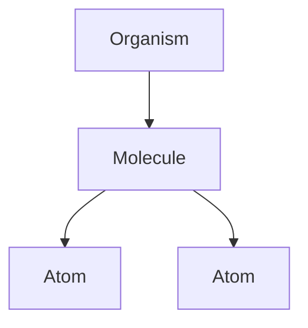

# Prompt: Generate Component Documentation

You are a senior technical writer AI. Your task is to generate a comprehensive `README.md` file for a component directory based on its source code.

## Instructions

1.  **Target Directory**: You will be given a single argument: the path to the root directory of the components to be documented.
    -   `[PATH_TO_COMPONENT_DIRECTORY]`

2.  **Analyze Source Code**: You MUST recursively scan the target directory, read every `.tsx` and `.ts` file, and analyze its content to understand:
    -   The purpose of each component, hook, and utility.
    -   The props, features, and overall functionality of each component.
    -   The relationships and dependencies between components (e.g., which molecules use which atoms).
    -   The overall data flow and state management strategy within the feature.

3.  **Generate README.md**: Create a `README.md` file using the exact structure and formatting outlined in the template below. The final document should be clear, detailed, and easy for a new developer to understand. Infer the component area name from the directory path.

---

## Documentation Template (To be filled by the AI)

# [Component Area Name] Components

*A brief, one-sentence description of what this set of components is for.*

## Component Hierarchy

*Generate a simple text-based tree diagram of the directory structure (e.g., atoms/, molecules/, organisms/, hooks/).*

```
[component-directory]/
├── atoms/
├── molecules/
├── organisms/
└── hooks/
```

## Components Overview

*For each component, create a section with the following details. Group them by their directory (Atoms, Molecules, Organisms).*

### 🔵 Atoms (Basic Building Blocks)

#### [ComponentName]
- **Purpose**: *Briefly explain what this component does based on its source code and comments.*
- **Features**: *List key features discovered from the code (e.g., "Color-coded based on status", "Handles multiple variants", "Accessible with ARIA labels").*
- **Location**: `[path/to/Component.tsx]`

### 🟢 Molecules (Composite Components)

#### [ComponentName]
- **Purpose**: *Briefly explain what this component does.*
- **Features**: *List key features.*
- **Uses**: *List the atom-level components it is composed of by analyzing its import statements (e.g., `Button`, `Icon`, `Badge`).*
- **Location**: `[path/to/Component.tsx]`

### 🔴 Organisms (Complex Sections)

#### [ComponentName]
- **Purpose**: *Briefly explain what this component does.*
- **Features**: *List key features.*
- **Uses**: *List the molecule-level components it orchestrates by analyzing its import statements.*
- **Location**: `[path/to/Component.tsx]`

## 🪝 Custom Hooks

*For each custom hook, create a section with the following details.*

#### [useHookName]
- **Purpose**: *Explain the hook's responsibility in managing state or logic.*
- **Features**: *List key features (e.g., "Manages sorting and filtering", "Handles API mutations with optimistic updates", "Persists state to localStorage").*
- **Location**: `[path/to/useHookName.ts]`

## 🛠 Utilities

*For each utility file, describe its purpose.*

#### [utilityName]
- **Purpose**: *Explain what the utility functions do (e.g., "Provides helper functions for file size and MIME type validation").*
- **Location**: `[path/to/utilityName.ts]`

## Data Flow

*Generate a `mermaid` graph to visualize the component hierarchy and data flow from the main organism down to the atoms. Infer this from the component `Uses` analysis.*



## Key Features

*Provide a high-level summary of the overall feature's capabilities, categorized into logical groups. Infer these from the component features and requirements documents if available.*

### [e.g., 📤 File Management]
- *Bullet points of key features*

### [e.g., ⚡ Performance]
- *Bullet points of key features*

### [e.g., ♿ Accessibility]
- *Bullet points of key features*

## Usage Example

*Provide a clear `tsx` code block showing how to import and use the primary organism component.*

```tsx
import { [MainOrganismComponent] } from '[import/path]';

function ExamplePage({ id }) {
  return (
    <[MainOrganismComponent] id={id} />
  );
}
```

## Dependencies

*List the key external libraries or internal services this feature depends on by analyzing import statements (e.g., TanStack Query, Zod, Lucide React).*

## Related Documentation

*If possible, list any relevant links to other documentation files, like requirements or design documents that might be co-located or referenced in comments.*
