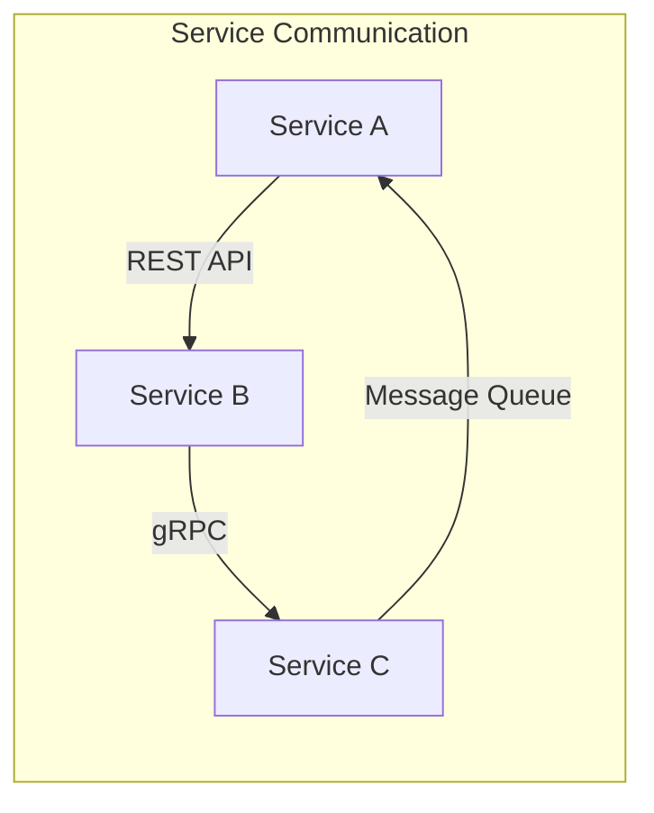

# Project Architecture

## 1. System Overview

### Architecture Style
[Monolithic / Microservices / Modular Monolith / Serverless / Hybrid]

### System Components
```mermaid
graph TB
    subgraph "System Overview"
        [Component diagram showing major modules/services and their relationships]
    end
```

### Modules/Services Inventory
| Module/Service | Purpose | Location | Status |
|:---------------|:--------|:---------|:-------|
| [name] | [what it does] | [path in repo] | [active/legacy/deprecated] |

## 2. Modules & Services

[For each module/service, create a subsection with its complete tech stack]

### 2.1 [Module/Service Name]

#### Purpose
[What this module/service does and why it exists]

#### Technology Stack
- **Language**: [Language and version]
- **Framework**: [Main framework and version]
- **Key Libraries**: [Essential dependencies]
- **Build Tool**: [Build system used]
- **Package Manager**: [npm/pip/go mod/maven/etc]

#### Structure
```
module-root/
├── [dir]/ - [Purpose]
├── [dir]/ - [Purpose]
└── [dir]/ - [Purpose]
```

#### Key Components
- **Entry Point**: [Main file/class]
- **Core Logic**: [Where business logic lives]
- **External APIs**: [Exposed interfaces]

#### Dependencies
| Dependency | Version | Purpose |
|:-----------|:--------|:--------|
| [name] | [version] | [what it's used for] |

#### Testing
- **Framework**: [Testing framework used]
- **Coverage**: [Current coverage %]
- **Test Location**: [Where tests are found]

#### Build & Run
```bash
# Install dependencies
[command]

# Build
[command]

# Run locally
[command]

# Run tests
[command]
```

#### Deployment
- **Method**: [How it's deployed]
- **Infrastructure**: [Where it runs]
- **Configuration**: [How it's configured]

### 2.2 [Next Module/Service]
[Repeat the above structure for each module]

## 3. Inter-Service Communication

### Communication Patterns


### API Contracts
| From Service | To Service | Protocol | Purpose | Documentation |
|:-------------|:-----------|:---------|:--------|:--------------|
| [service] | [service] | [REST/gRPC/etc] | [what it does] | [link/location] |

### Message Patterns
- **Synchronous**: [REST APIs, gRPC calls, etc.]
- **Asynchronous**: [Message queues, event streams, etc.]
- **Service Discovery**: [How services find each other]

### Shared Resources
- **Databases**: [Which services share which databases]
- **Caches**: [Shared caching layers]
- **File Storage**: [Shared file systems or object storage]

## 4. Data Architecture

### Data Storage
| Storage System | Type | Purpose | Used By |
|:---------------|:-----|:--------|:--------|
| [name] | [SQL/NoSQL/Cache/etc] | [what it stores] | [which services] |

### Data Flow
```mermaid
graph TD
    subgraph "Data Flow"
        [Diagram showing how data moves through the system]
    end
```

### Data Models
[Key entities and their relationships across services]

### Data Consistency
- **Strategy**: [How consistency is maintained across services]
- **Transaction Boundaries**: [Where transactions start/end]

## 5. Shared Infrastructure

### Authentication & Authorization
- **Method**: [How auth is handled system-wide]
- **Service**: [Which service handles auth]
- **Token Management**: [How tokens are managed]

### Common Services
| Service | Purpose | Technology | Endpoint |
|:--------|:--------|:-----------|:---------|
| [Auth Service] | [Authentication] | [Tech stack] | [URL/location] |
| [API Gateway] | [Request routing] | [Tech stack] | [URL/location] |

### Message Infrastructure
- **Message Broker**: [RabbitMQ/Kafka/etc if used]
- **Event Bus**: [Event streaming if used]
- **Queue Management**: [How queues are managed]

### Monitoring & Logging
- **Logging**: [Centralized logging solution]
- **Monitoring**: [APM tools, metrics collection]
- **Tracing**: [Distributed tracing if used]

## 6. Development Workflow

### Repository Structure
```
project-root/
├── services/         # Microservices
│   ├── service-a/
│   └── service-b/
├── libs/            # Shared libraries
├── tools/           # Build tools and scripts
└── docs/            # Documentation
```

### Local Development
```bash
# Clone repository
git clone [repo]

# Setup instructions for multi-service development
[Steps to run all services locally]
```

### Development Tools
- **Service Orchestration**: [docker-compose/kubernetes/etc]
- **Local Testing**: [How to test inter-service communication locally]
- **Mock Services**: [How to mock dependencies]

## 7. Testing Strategy

### Test Levels
- **Unit Tests**: [Per service testing approach]
- **Integration Tests**: [Cross-service testing]
- **End-to-End Tests**: [Full system testing]
- **Contract Tests**: [API contract validation]

### Test Execution
```bash
# Run all unit tests
[command]

# Run integration tests
[command]

# Run specific service tests
[command]
```

## 8. Build & Deployment

### Build Pipeline
- **CI System**: [Jenkins/GitHub Actions/etc]
- **Build Strategy**: [Monorepo/polyrepo approach]
- **Artifact Management**: [How artifacts are stored]

### Deployment Strategy
- **Orchestration**: [Kubernetes/ECS/etc]
- **Service Deployment**: [How individual services are deployed]
- **Database Migrations**: [How schema changes are handled]
- **Blue-Green/Canary**: [Deployment strategies used]

### Environments
| Environment | Purpose | Infrastructure | Access |
|:------------|:--------|:---------------|:-------|
| Development | Dev testing | [where/how] | [URL] |
| Staging | Pre-prod | [where/how] | [URL] |
| Production | Live | [where/how] | [URL] |

## 9. Security Architecture

### Security Boundaries
- **Network Security**: [How services are isolated]
- **API Security**: [API authentication/authorization]
- **Data Security**: [Encryption at rest/in transit]

### Secrets Management
- **Method**: [How secrets are stored/accessed]
- **Rotation**: [Secret rotation policy]

## 10. Performance & Scaling

### Scaling Strategy
- **Horizontal Scaling**: [Which services can scale horizontally]
- **Vertical Scaling**: [Resource limits and scaling]
- **Auto-scaling**: [Auto-scaling policies]

### Performance Optimization
- **Caching Layers**: [Where caching is implemented]
- **Database Optimization**: [Indexing, query optimization]
- **Service Optimization**: [Service-specific optimizations]

### Load Balancing
- **Strategy**: [How load is distributed]
- **Health Checks**: [Service health monitoring]

## 11. Disaster Recovery

### Backup Strategy
- **Data Backup**: [How data is backed up]
- **Configuration Backup**: [How configs are preserved]

### Recovery Procedures
- **RTO**: [Recovery time objective]
- **RPO**: [Recovery point objective]
- **Runbooks**: [Where recovery procedures are documented]

## 12. Technical Debt & Roadmap

### Known Issues
| Issue | Impact | Affected Services | Priority |
|:------|:-------|:------------------|:---------|
| [description] | [impact] | [services] | [high/medium/low] |

### Improvement Opportunities
- [Architectural improvements needed]
- [Technical debt to address]
- [Modernization opportunities]

### Deprecated Components
- **Component**: [What's deprecated and replacement plan]

## 13. Documentation

### Service Documentation
| Service | API Docs | Architecture Docs | Runbooks |
|:--------|:---------|:------------------|:---------|
| [service] | [location] | [location] | [location] |

### System Documentation
- **Architecture Decisions**: [ADR location]
- **API Standards**: [API design guidelines]
- **Development Guidelines**: [Coding standards location]

## 14. Team & Ownership

### Service Ownership
| Service/Module | Team | Tech Lead | On-Call |
|:---------------|:-----|:----------|:--------|
| [service] | [team name] | [person] | [rotation] |

### Communication
- **Slack Channels**: [Relevant channels]
- **Documentation**: [Wiki/Confluence location]
- **Issue Tracking**: [JIRA/GitHub project]

---

## Metadata

**Last Updated**: [Date]
**Updated By**: [What triggered the update]
**Scope**: [Full analysis / Partial update / New service added]

### Change Log
- [Date]: [What was updated]
- [Date]: Initial architecture documentation

### Review Schedule
- **Next Review**: [Date]
- **Review Owner**: [Team/Person]