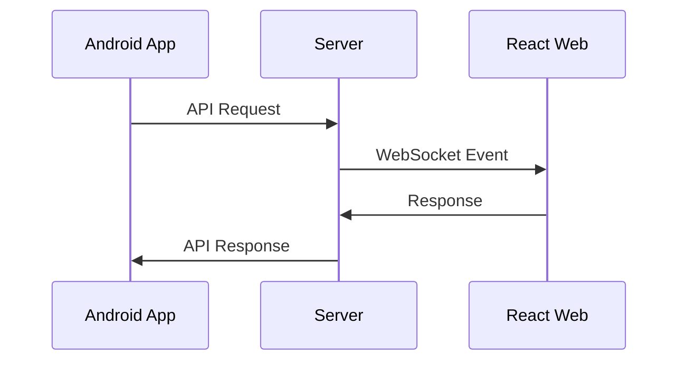

# Integration Design - {Feature Name}

## Overview

Brief description of how this feature integrates across multiple modules.

## Module Responsibilities

### Server Module
- **Role**: What the server is responsible for in this feature
- **APIs**: What endpoints/interfaces the server provides
- **Data**: What data the server manages for this feature
- **Events**: What events the server publishes/consumes

### Frontend-React Module  
- **Role**: What the React frontend is responsible for
- **Components**: Key UI components for this feature
- **State**: How feature state is managed in React
- **API Calls**: How it interacts with server APIs

### Frontend-Android Module
- **Role**: What the Android app is responsible for
- **Activities/Fragments**: Key Android screens for this feature
- **Services**: Any Android services involved
- **Data Sync**: How it syncs with server data

## Integration Points

### Data Flow

### API Contracts
- **Endpoints**: List of API endpoints involved
- **Data Models**: Shared data structures
- **Authentication**: How modules authenticate with each other
- **Error Handling**: Cross-module error propagation

### Real-time Communication
- **WebSocket Events**: Events sent between modules
- **Message Format**: Structure of real-time messages
- **Connection Management**: How connections are established/maintained

## Sequence Diagrams

### Primary Use Case Flow

## Cross-Module Dependencies

### Shared Models
- **Data Models**: Common data structures used across modules
- **Validation Rules**: Shared validation logic
- **Constants**: Shared constants and enums

### Synchronization Requirements
- **Data Consistency**: How data stays consistent across modules
- **Conflict Resolution**: How conflicts are resolved
- **Offline Handling**: How each module handles offline scenarios

## Testing Strategy

### Integration Testing
- **API Testing**: Server API testing with multiple client types
- **End-to-End Testing**: Full user journey across modules
- **Real-time Testing**: WebSocket communication testing

### Cross-Module Contracts
- **Schema Validation**: Ensuring API contracts are maintained
- **Mock Services**: How modules can be tested in isolation
- **Test Data**: Shared test data across modules

## Deployment Considerations

### Versioning
- **API Versioning**: How API changes are managed
- **Feature Flags**: Cross-module feature rollout strategy
- **Backward Compatibility**: Maintaining compatibility during updates

### Monitoring
- **Cross-Module Metrics**: Metrics that span multiple modules
- **Error Tracking**: How errors are tracked across the system
- **Performance**: End-to-end performance monitoring

## Security Considerations

### Authentication Flow
- **Token Management**: How auth tokens are shared/validated
- **Permission Model**: Cross-module permission checking
- **Secure Communication**: Encryption between modules

### Data Protection
- **Sensitive Data**: How sensitive data flows between modules
- **Audit Logging**: Cross-module audit trail
- **Access Control**: Module-level access restrictions

## Rollout Plan

### Phase 1: Foundation
- Core server APIs
- Basic authentication
- Initial data models

### Phase 2: Client Integration
- Android app integration
- React web app integration
- Real-time communication

### Phase 3: Enhancement
- Advanced features
- Performance optimization
- Full monitoring

## Risk Mitigation

### Technical Risks
- **Network Failures**: How modules handle connectivity issues
- **Version Skew**: Managing different module versions
- **Data Corruption**: Preventing cross-module data issues

### Operational Risks
- **Deployment Coordination**: Coordinating multi-module deployments
- **Rollback Strategy**: How to rollback cross-module changes
- **Support**: Cross-module issue debugging and support

## Success Metrics

### Functional Metrics
- **Feature Completion Rate**: % of user journeys completed successfully
- **Data Consistency**: % of data synchronized correctly
- **Real-time Latency**: Message delivery time between modules

### Operational Metrics
- **System Uptime**: Overall system availability
- **Integration Points**: Health of cross-module communication
- **Error Rates**: Cross-module error frequency

---

*Last Updated: {Date}*
*Modules Involved: {List of modules}*