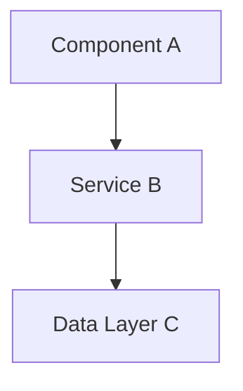

# {Feature Name} - {Module Name} Design

## Module Context

**Module**: {Module Name}
**Technology Stack**: {Module Technologies}
**Module Directory**: {Module Directory}

## Overview

Brief description of how this feature works within the {Module Name} module.

## Module Scope

### What This Module Owns
- List specific responsibilities within this module
- Components, services, or functionality owned by this module
- Data or state managed by this module

### Module Boundaries
- What this module does NOT handle (delegated to other modules)
- Dependencies on other modules
- Interfaces exposed to other modules

## Architecture

### Module-Specific Architecture


### Technology-Specific Patterns
- Framework-specific patterns used in this module
- Module-specific architectural decisions
- Technology stack utilization

## Components and Interfaces

### Internal Components
List components that exist only within this module:

#### {Component Name}
- **Purpose**: What this component does
- **Technology**: Framework/library used
- **Dependencies**: Other internal components it depends on
- **Interface**: Public API it exposes

### External Interfaces
Interfaces this module exposes to other modules:

#### {Interface Name}
- **Type**: REST API / WebSocket / Event / etc.
- **Purpose**: What other modules use this for
- **Contract**: Data format and protocol
- **Authentication**: How access is controlled

### Module Dependencies
External dependencies this module requires:

#### {Dependency Name}
- **Source**: Which module/service provides this
- **Type**: API call / Event subscription / Database / etc.
- **Fallback**: What happens if dependency is unavailable

## Data Models

### Module-Specific Models
Data structures used within this module:

```typescript
interface {ModelName} {
    // Module-specific data structure
}
```

### Shared Models
Data structures shared with other modules:

```typescript
interface {SharedModel} {
    // Cross-module data structure
}
```

## Module-Specific Implementation

### Framework Patterns
- {Framework} specific implementation patterns
- State management approach
- Navigation/routing patterns (if applicable)
- Styling/theming approach (if applicable)

### Error Handling
- Module-specific error handling strategy
- How errors are logged and reported
- Error propagation to other modules
- User-facing error presentation

### Configuration
- Module-specific configuration
- Environment variables used
- Feature flags specific to this module

## Testing Strategy

### Module-Level Testing
- Unit testing approach for this module
- Integration testing within module boundaries
- Mock strategies for external dependencies

### Cross-Module Testing
- How this module is tested with other modules
- Contract testing for exposed interfaces
- End-to-end testing participation

## Performance Considerations

### Module-Specific Performance
- Performance requirements for this module
- Optimization strategies
- Resource usage patterns
- Caching strategies

### Cross-Module Performance
- Impact on other modules
- Communication efficiency
- Data transfer optimization

## Security Considerations

### Module Security
- Authentication and authorization within module
- Data validation and sanitization
- Secure storage (if applicable)
- Security logging

### Cross-Module Security
- Secure communication with other modules
- Trust boundaries
- Data encryption requirements

## Deployment and Operations

### Module Deployment
- How this module is built and deployed
- Environment-specific configurations
- Database migrations (if applicable)
- Static asset management (if applicable)

### Monitoring and Observability
- Module-specific metrics
- Logging strategy
- Health checks
- Performance monitoring

## Migration and Compatibility

### Version Compatibility
- How this module maintains compatibility
- API versioning strategy
- Database schema changes
- Breaking change management

### Legacy Support
- Support for older versions
- Migration path from legacy systems
- Deprecation strategy

---

*Module: {Module Name}*
*Last Updated: {Date}*
*Technology Stack: {Technologies}*